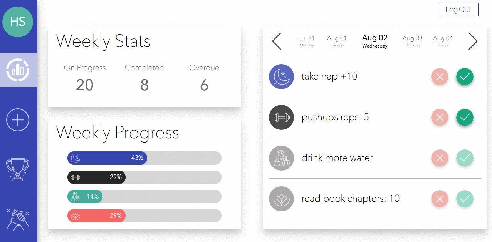

# Wellness Game

This Web app lets users track their wellness activities each week.

## Features

#### Adding activities

* Users can easily add their daily activities for each of the 4 categories: rest, nutrition, sweat, and personal wellness

#### Dashboard

* The dashboard displays the user's weekly stats, as well as a progress chart, and a spark line chart for each of the four categories.

* It also displays the user's current activities, which can be mark as complete or incomplete by clicking on the checkboxes.

#### Leaderboards

* Users can also see a table which displays other users weekly stats, as wells as their rank each week.

#### Screenshot

#### Future updates

* Rewards: weekly winners are rewarded with the ability to put extra challenges to the whole group.

* Challenge of the week: this challenge would be weekly and will become available to all users

* Web sockets: this way we can create a real time database and users can send messages to each other.
